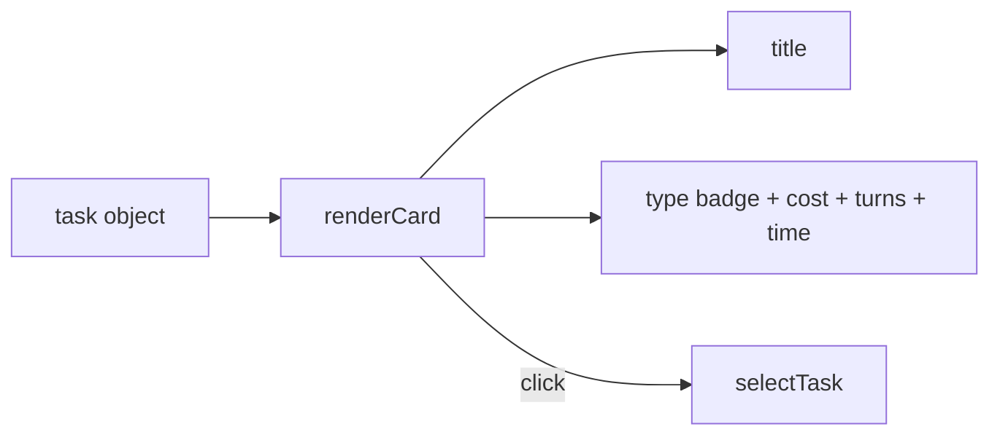
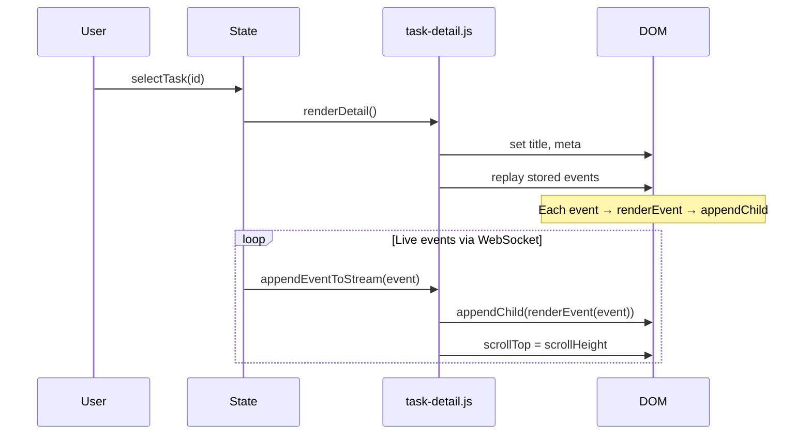

# Event Rendering

How task events are rendered in the detail panel.

## Event Kinds

| Kind           | Data                     | Rendered As                    |
| -------------- | ------------------------ | ------------------------------ |
| `text`         | `{text}`                 | Markdown → sanitized HTML      |
| `tool_use`     | `{name, input}`          | Tool name header + JSON input  |
| `tool_result`  | `{tool_use_id, content}` | Result header + content        |
| `approval_req` | `{name, input}`          | Tool info + Allow/Deny buttons |
| `error`        | `{message}`              | Red error block                |

## Task Card

## Task Detail

## Append-Only Pattern

The event stream is append-only. New events call
`container.appendChild(renderEvent(event))` — O(1) per event.
No re-rendering of the full list. This is why vanilla DOM
outperforms React's virtual DOM for this use case.

## Markdown Safety

All markdown is rendered via `marked.parse()` then sanitized
with `DOMPurify.sanitize()` before being set as `innerHTML`.
This prevents XSS from task output containing malicious HTML.
