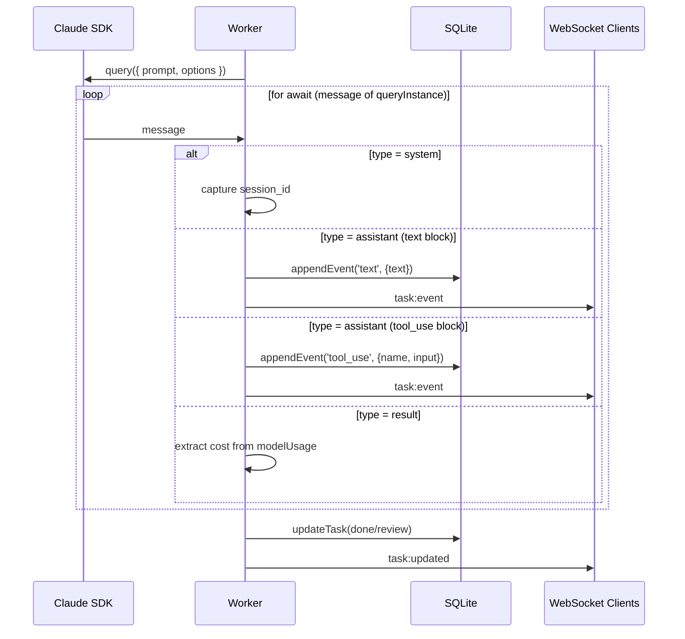
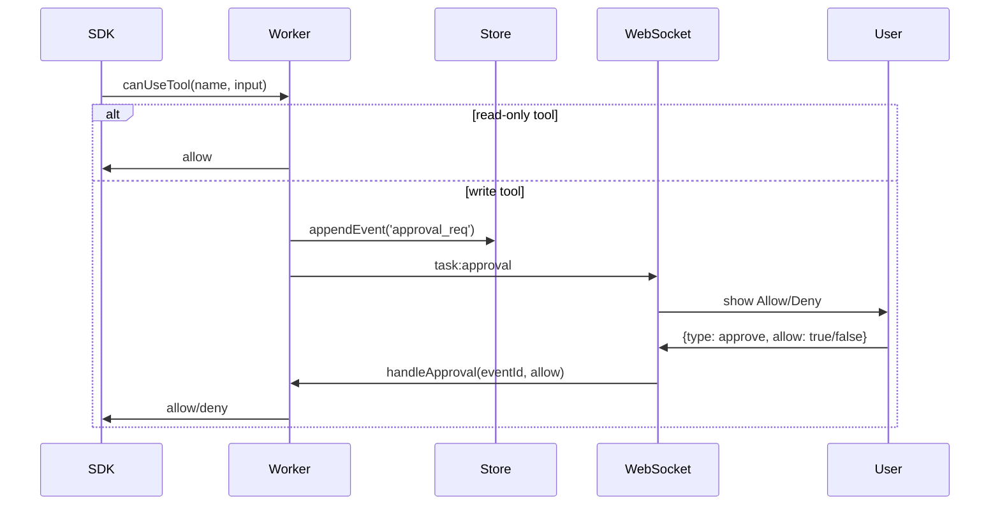

# Worker Streaming

How the Worker class bridges the Claude SDK async generator to
WebSocket clients and the SQLite event log.

## Run Loop

## Message Types

The SDK yields three message types:

| Type        | Contains                   | Action                                      |
| ----------- | -------------------------- | ------------------------------------------- |
| `system`    | `session_id`               | Capture for resume capability               |
| `assistant` | `message.content[]` blocks | Map to events (text, tool_use, tool_result) |
| `result`    | `modelUsage`               | Extract cumulative token counts for cost    |

## Event Append

Every piece of SDK output is persisted as a `task_events` row before
being broadcast. This guarantees no data loss if a client disconnects
mid-stream.

## Approval Flow

## Broadcast

`broadcast(msg)` iterates all connected WebSocket clients and sends
JSON. Clients filter by `taskId` — only the task detail view for the
matching task processes the event.

## Incremental Fetch

`GET /api/tasks/:id/events?after=eventId` returns only events with
`id > afterId`. This enables clients that reconnect to catch up
without re-fetching the full history.
